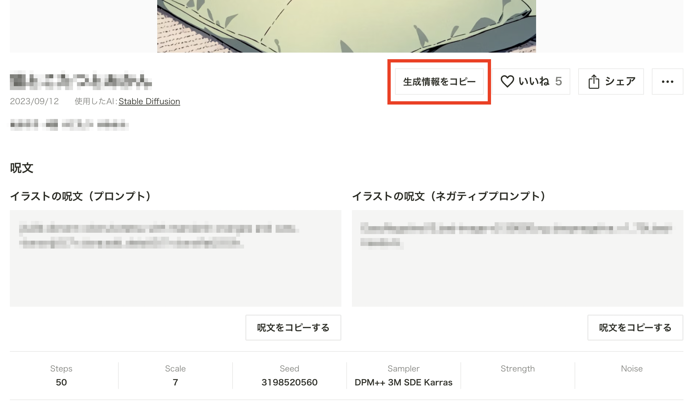
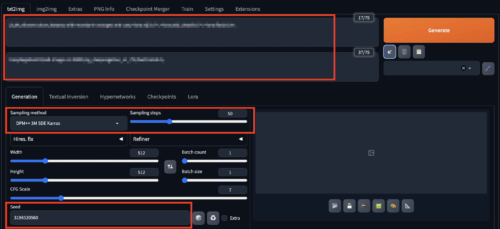

# puicopy

AIイラスト・AIフォト・AIグラビア専用の投稿サイトである[『chichi-pui（ちちぷい）』](https://www.chichi-pui.com/)で公開されている呪文・プロンプトを、infotext形式でクリップボードにコピーすることができる機能を提供するChrome拡張機能です。

[Chrome拡張機能はこちらからダウンロードできます。](https://chrome.google.com/webstore/detail/puicopy-copy-to-clipboard/jncfknbdioaeiklmhgcoppljffappgkk)

## Usage
Chrome拡張機能を有効にした状態、かつchichi-pui（ちちぷい）にログインした状態で、ちちぷいの投稿画像の閲覧画面にアクセスすると、`生成情報をコピー`ボタンが追加されます。  
こちらをクリックすると、`infotext`形式でクリップボードにコピーされます。

こちらを[Stable Diffusion web UI](https://github.com/AUTOMATIC1111/stable-diffusion-webui)のプロンプト欄にコピーし、画面右側の矢印ボタンをクリックすることで、

* Negative Prompt
* Sampling Methods
* Sampling Steps
* Seed

に値を貼り付けることが可能です。

## License

MIT